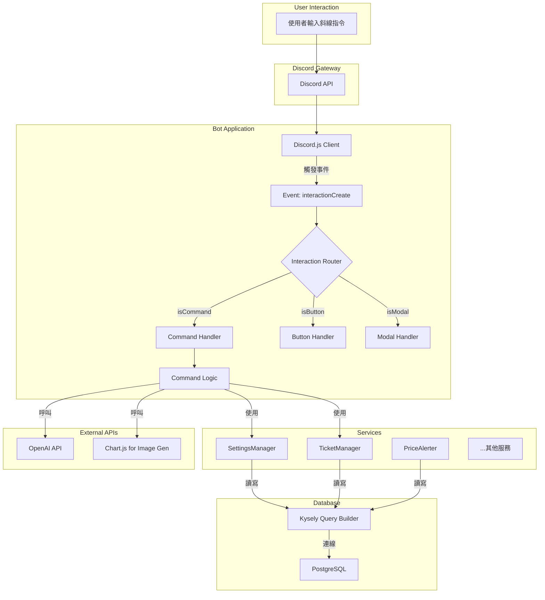

# 系統架構

本文件旨在說明此 Discord 機器人專案的技術架構、目錄結構與核心模組職責，幫助開發者快速理解系統的設計與運作方式。

## 系統架構圖 (Mermaid.js)



## 目錄結構說明

專案採用了清晰、可擴展的目錄結構，實現了關注點分離 (Separation of Concerns)。

```
src/
├── commands/           # 所有斜線指令
│   ├── admin/          # 管理員專用指令
│   ├── public/         # 公開指令
│   └── utility/        # 工具型指令
├── events/             # Discord Client 事件處理器
│   └── interactionCreate.ts # 核心互動路由
├── interactions/       # 按鈕、選單、Modal 等互動元件的處理邏輯
│   ├── buttons/
│   └── modals/
├── services/           # 核心業務邏輯服務
│   ├── TicketManager.ts
│   └── SettingsManager.ts
├── interfaces/         # TypeScript 核心物件介面
│   ├── Command.ts
│   └── Button.ts
├── shared/             # 共享模組
│   └── database/       # 資料庫連線、遷移與查詢
├── utils/              # 共用工具函式 (logger, errorHandler)
├── config.ts           # 專案設定檔
└── index.ts            # 應用程式進入點
```

## 核心模組職責

*   **`index.ts` (進入點)**
    *   職責：初始化 Discord Client、讀取環境變數、實例化核心服務 (如 `SettingsManager`)、動態載入並註冊所有指令與事件。

*   **`events/interactionCreate.ts` (互動路由器)**
    *   職責：監聽所有來自 Discord 的互動事件。根據互動類型（指令、按鈕、Modal），將其分派給對應的處理器。這是整個機器人互動流程的核心。

*   **`commands/` (指令模組)**
    *   職責：每個子目錄下的 `index.ts` 都定義了一個斜線指令。每個指令都是一個實作 `Command` 介面的物件，封裝了指令的定義 (`data`) 和執行邏輯 (`execute`)。
    *   設計模式：**命令模式 (Command Pattern)**。

*   **`services/` (服務層)**
    *   職責：封裝核心且可重用的業務邏輯。例如，`TicketManager` 處理所有與票務系統相關的操作。這些服務被設計為單例，在應用程式啟動時初始化，並在需要時注入到指令中。
    *   設計模式：**單例模式 (Singleton Pattern)**。

*   **`shared/database/` (資料庫層)**
    *   職責：集中管理所有與資料庫的互動。
    *   `index.ts`: 匯出 Kysely 的 `db` 實例。
    *   `migrations/`: 存放資料庫結構的遷移檔案，用於版本控制。
    *   `queries.ts`: 封裝常用的 SQL 查詢。
    *   `types.ts`: Kysely 根據資料庫結構自動生成的型別定義，提供完整的型別安全。

## 資料庫結構

專案使用 **PostgreSQL** 作為主要資料庫，並透過 **Kysely** 進行型別安全的查詢。資料庫的結構是透過 `src/shared/database/migrations/` 目錄下的遷移檔案來定義和演進的。

主要的資料表可能包含：

*   `tickets`: 儲存票務資訊，如狀態、建立者、負責人等。
*   `ticket_settings`: 儲存各伺服器的票務系統設定。
*   `price_alerts`: 儲存使用者設定的價格提醒。
*   `keywords`: 儲存用於自動回應的關鍵字與回應內容。
*   `guild_settings`: 儲存各伺服器的通用設定。

這種設計確保了資料庫結構的變更是可追蹤、可版本控制的，並且 Kysely 的型別生成能力極大地提升了開發效率與程式碼的可靠性。